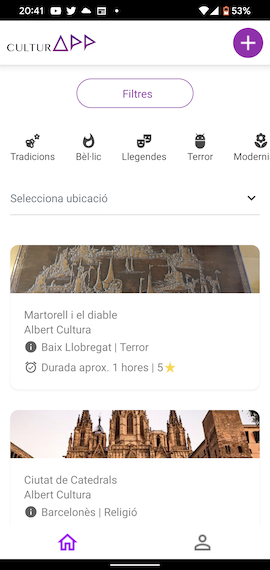
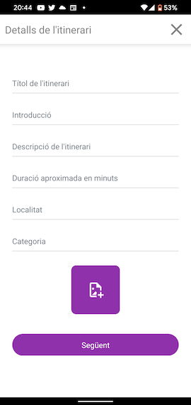
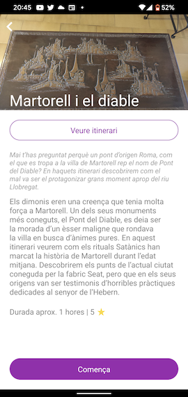
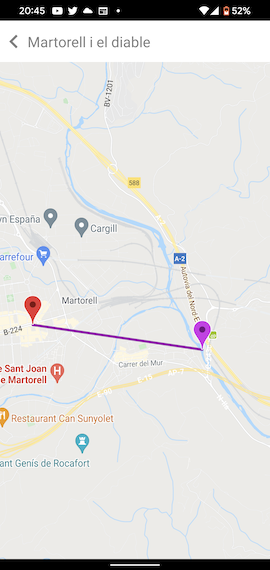
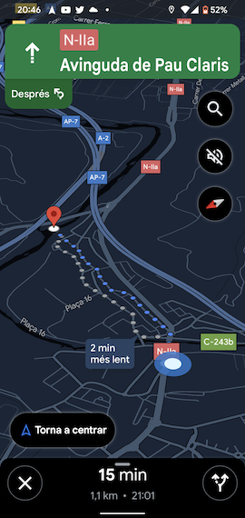
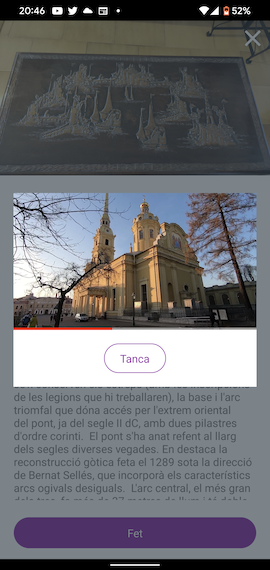
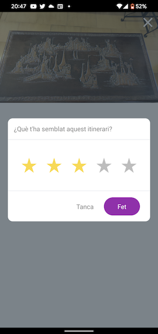
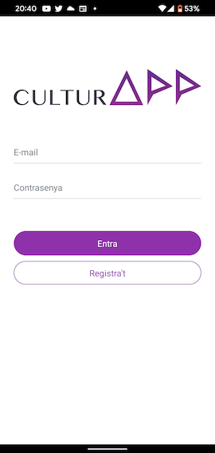

# REACT NATIVE CULTURAPP
Application for creation and visualization of cultural routes.

This project is part of the UOC MDFP (Master's Degree final Project - Master's degree on mobile applications)

## App Preview

## Video demo
